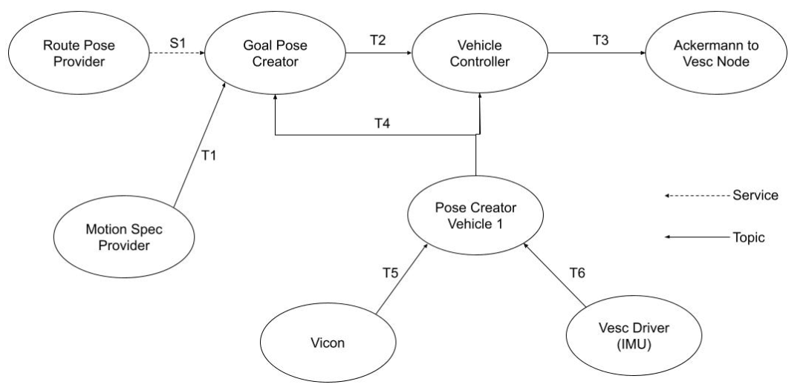
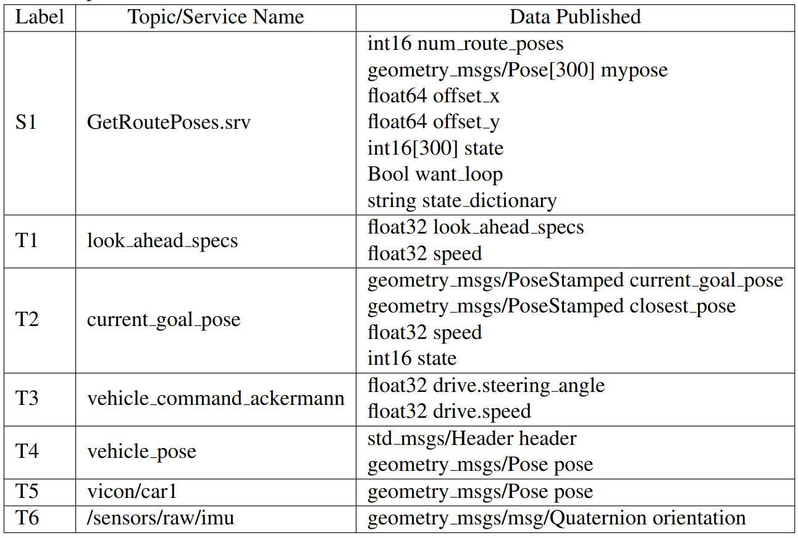
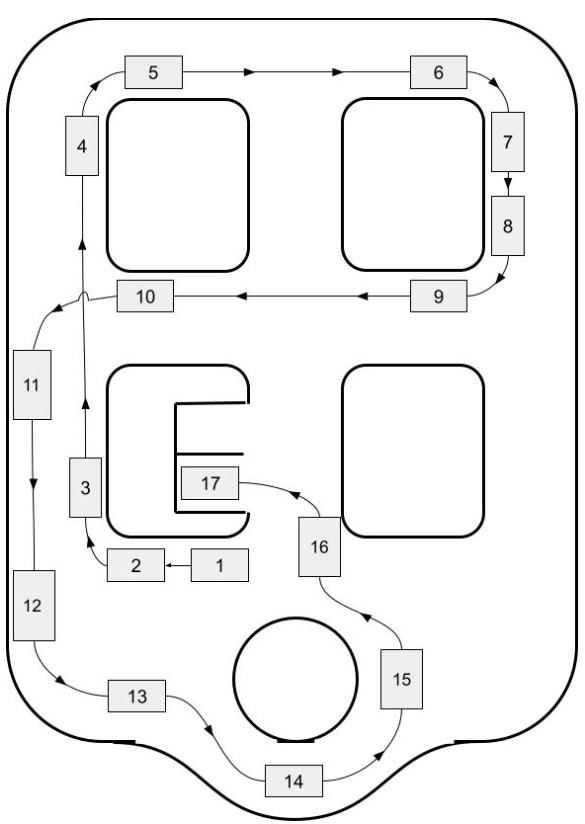

# SAL1Tenth-code
Package for the SAL1Tenth cars. Supports all new cars added to the SAL Lab

## Launch files
- simulation_demo.launch.py: launches simulation demo for two cars in rviz simulation
- vehicle.launch.py: launches car demo for two f1tenth cars
- visualization.launch.py: visualize car in 3d space with motion capture

## Paths
- pose_list_car1.txt: edit the path of car1
- pose_list_car2.txt: edit the path of car2

## Data flow

## Node tree and Graph

## Car Path

